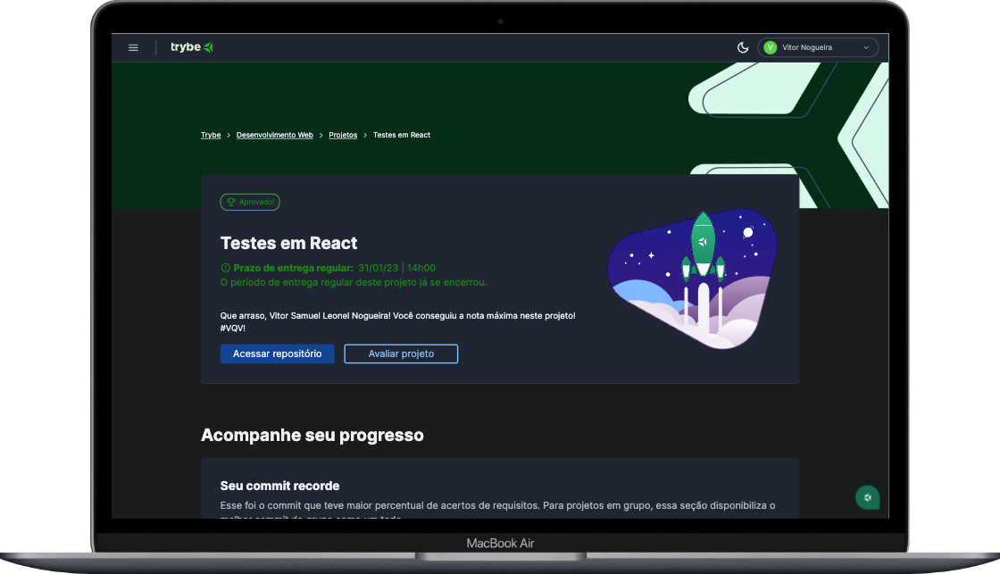

## React Testing Library 🧪



---
<details>
<summary><span style="font-size: 1.5rem;"> 👨🏼‍💻 Proposta</span></summary>
  - Escrever testes para uma aplicação React que já está implementada, uma Pokédex</br>
  - Os testes devem ser escritos utilizando <code>RTL e Jest</code>; </br>
  - Matar os mutantes da Lib <code>Stryker Mutation</code> que foi utilizada para avaliar nosso projeto; </br>
  - Utilizar os seletores (queries) da React-Testing-Library em testes automatizados;</br>
  - Simular eventos com a React-Testing-Library em testes automatizados; </br>
  - Testar rotas criadas com React Router com a React Testing Library; </br>
</details>

---
<details>
<summary><span style="font-size: 1.5rem;"> 📝 Funcionalidades</span></summary>
  - Visualizar um pokémon e suas características </br>
  - Pular para o próximo pokémon </br>
  - Filtrar por tipo do pokémon </br>
  - Favoritar e desfavoritar um pokémon </br>
</details>

---
<details>
<summary><span style="font-size: 1.5rem;"> 💡 Tecnologias Utilizadas</span></summary>
  - RTL (React Testing Library) </br>
  - Jest 
</details>

----
### Como executar o projeto
1. Clone este repositório
````
git clone git@github.com:vitor-nogueira-dev/react-testing-library.git
````
2. Na pasta raiz do projeto, execute o seguinte comando para instalar as dependências:
```
npm install
``` 
3. Execute o comando para iniciar a aplicação: 
````
npm start
````

### Contribuições
> 💡Contribuições são bem-vindas! Se você tiver alguma sugestão ou encontrar um bug, por favor, abra uma issue ou envie um pull request.


